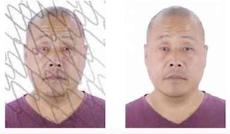

# DeMeshNet (Remove mesh in keras)

### 1. mesh.ipynb (abandoned)

### 2. mesh_generator.py and preprocess.ipynb
Adding mesh to photos. (revised from https://github.com/CosmosHua/GAN_Mesh)
**Note: The saving quality in cv2 (cv2.IMWRITE_JPEG_QUALITY) should be controled in [15, 50] for more generalization**

### 3. models
> SegNet

> Hourglass
